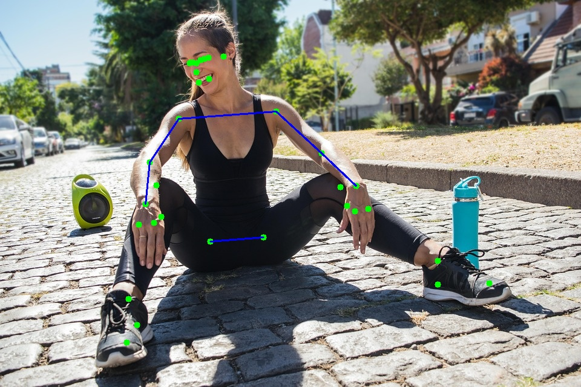
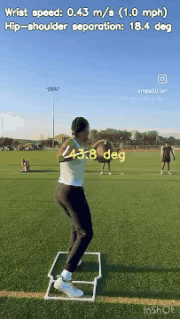
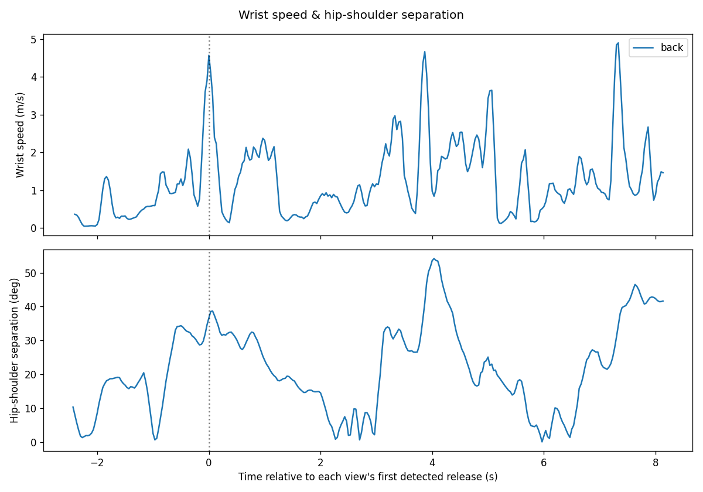

# qb-pose

Quarterback throwing-motion biomechanics analysis using [MediaPipe Pose Landmarker](https://ai.google.dev/edge/mediapipe/solutions/vision/pose_landmarker).

It detects a 33-point body skeleton on an image or video of a QB throwing and computes:

- **Elbow angle** at the throwing arm, drawn live on every frame, plus specifically at release and at "max cocking" (approximated as the pause in wrist speed right before the forward swing)
- **Wrist speed** — throwing-hand speed over time (a proxy for release speed, not ball speed)
- **Release time(s)** — detected as the peak(s) in wrist speed; a clip can contain several throwing reps
- **Hip-shoulder separation** — rotational lead of the hips over the shoulders, a proxy for throwing efficiency
- **Trunk lean** and **stride length** (peak foot separation) around release
- **Consistency across reps** — mean/stddev/CV% of the above across every detected release in a clip, not just one throw's numbers
- **Ball tracking** (experimental) — best-effort tracking of the actual football for a real speed/launch angle instead of the wrist-speed proxy; see [below](#ball-tracking-experimental) for when it does and doesn't work

The reusable analysis code lives in [`analysis.py`](analysis.py); `demo.ipynb` and the [web app](#web-app) are both thin front-ends on top of it.

## Example

Static skeleton overlay on a still frame:



Wrist speed, hip-shoulder separation, and a release flash burned into the video:



Wrist speed and hip-shoulder separation over the full clip (three throwing reps), aligned to the detected release:



## Usage

1. Install dependencies: `uv sync`
2. Open `demo.ipynb` (e.g. `uv run jupyter lab`) and run all cells.

Each section saves its annotated output to disk (`output_image.jpg`, `qb-throw-annotated.mp4`, `throw-metrics.png`) and additionally opens a live preview window if a display is available.

## Web app

```
uv run streamlit run app.py
```

Upload a back-view clip (and optionally side/front clips of the same throw) and get the annotated video, the release-event table, and the metrics chart back in the browser — no notebook required. Clips longer than 60s are rejected to keep processing bounded; a single ~10s clip takes roughly 15-30s on CPU.

The output video is transcoded to H.264 (`analysis.transcode_to_h264`, via the static ffmpeg binary bundled by `imageio-ffmpeg`) so it plays inline in the browser — `cv2.VideoWriter`'s own default codec doesn't.

This is a single-process, synchronous demo app: one upload is processed per request, in-process. It's fine for local/personal use as-is; a public multi-user deployment would want the analysis to run as a background job (e.g. a task queue) instead of blocking the web request, so one slow upload can't stall everyone else's.

### Deploying it publicly (Streamlit Community Cloud)

The fastest way to get a shareable URL is [Streamlit Community Cloud](https://share.streamlit.io) (free): sign in with GitHub, "Create app" → "Yup, I have an app", point it at this repo/branch and `app.py`, and deploy — it defaults to Python 3.12, matching this project, no extra config needed.

`requirements.txt` is committed alongside `pyproject.toml` specifically for this: Community Cloud installs from `requirements.txt`/`pyproject.toml` itself, but reads a bare `pyproject.toml` as Poetry format, which this project's (uv/PEP 621) isn't — so it needs the plain `requirements.txt` instead. Regenerate it after changing dependencies with:

```
uv export --format requirements-txt --no-dev --no-hashes > requirements.txt
```

Community Cloud's free tier has modest CPU/RAM, so processing a clip there will likely be slower than the ~15-30s seen locally — the 60s clip-length cap in `app.py` helps keep any one request bounded.

## Multi-view (side & front)

`analyze_video()` and `compare_views()` in `analysis.py` work on a video from any camera angle — MediaPipe assigns landmarks by the subject's own anatomical left/right, not by where the camera is standing. Drop a `qb-throw-side.mp4` and/or `qb-throw-front.mp4` of the same throwing session next to `qb-throw.mp4` and re-run the "Multi-View Comparison" cell in the notebook to overlay all views (each aligned to its own detected release).

This isn't true synchronized 3D triangulation — that needs calibrated, timestamp-aligned cameras filming the same instant — but it does let you sanity-check whether independent single-view measurements roughly agree, since a 2D-plane joint angle or speed estimate can be distorted by which way the camera happens to be facing.

## Ball tracking (experimental)

`track_ball_release()` tries to track the football itself for a short window after each detected release, instead of only reporting the throwing-hand speed. It's a lightweight classical-CV detector (frame differencing in a small region ahead of the hand), not a trained object detector, self-calibrated to real-world units from the thrower's own body (meters-per-pixel derived from a body segment's known real length vs. its pixel length in that frame — no physical reference object needed).

It only reports a result when it finds a track that's internally consistent (real net motion, roughly toward where the QB threw, without erratic frame-to-frame jumps) — on the bundled `qb-throw.mp4` it currently finds nothing, and that's the correct, honest behavior rather than a bug: this is a back-view clip with other people in the background, and the ball is moving mostly *into* the depth of the scene rather than laterally across the frame, which is close to a worst case for a 2D pixel-based tracker. A side-view clip, where the ball crosses the frame laterally, is expected to work much better — this is one more reason the [multi-view](#multi-view-side--front) feature above is worth using.

## Testing

```
uv run pytest
```

Covers the pure numeric helpers (`smooth`, `transverse_angle`, `find_peaks`, `angle_between`, the ball detector on synthetic frames) plus integration tests that run the full pipeline against the bundled `qb-throw.mp4` and check it finds real release events, per-rep angles, and cross-rep consistency stats.
